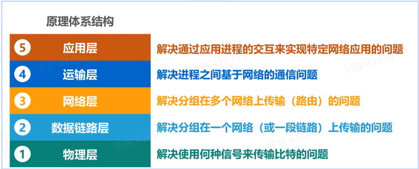

# 泛谈智能驾驶

## 1. 智能驾驶浪潮下的变化
智能驾驶浪潮下带来的根本性的变化是 “车” 的角色的转变。过去车是工具，交互发生在车与人之间；现在的车是智能体，交互发生在车与人、车与环境、车与任何交通参与者之间。这样的变化也就衍生出了一大堆新概念（定制化驾驶、驾驶风格学习等）。  
智能驾驶分级制度的核心界限在于L3，涉及交通责任的划分以及一系列道德伦理问题。针对其现状，业内有两条研发主路径：
>特斯拉为代表的渐进派 L2不断到L3；  
>Google Waymo为代表的跃进派：在有限营运场景内L4逐渐泛化到全场景L4。  

两者的核心区别在于前者可以作为附加产品进行销售，后者则只是实验室内进行研究（当然矿山L4也可以盈利，但是市场份额相对较少）。随着行业寒气到来，跃进派没有了金主爸爸的投喂，也要思考如何生存，典型例子有元戎启行、轻舟智航等。所以可以说现在行业内大都在做L2.999,但是其系统以及传感器配置还是聚焦L4进行设计的。  

随着智能技术的发展，用户的需求变化越来越快，车企必须相对应缩短研发时间，但是传统汽车倾向于应用分散式设计（与之相对应的是集中式设计，如手机电脑等），于是汽车在逐渐转向域控设计。但是也存在问题，通常产品性能是与硬件性能成正比的，但是硬件性能存在物理极限，于是厂商通过从“通用化”向“定制化”进行转变，来提高产品性能。
>举个简单例子，现在专门的智驾芯片就是通用化到定制化的代表，它带来的缺点是需要对多款产品进行选型，成本不好把控。  

同时，定制化集中式的设计不代表分散式的消失，通过集中式的硬件配合分散式的软件，似乎可以鱼和熊掌得兼，但带来的研发难度也随之上升很多。
### 1. 整车架构变化 
首先汽车的整车架构发生巨大变化。传统整车主要有三大件：1. 发动机：提供动力 2. 变速箱：适应多变行驶条件，使得汽车运行在合适工况 3. 底盘：保持车辆正常行驶，接受动力传递给车轮。包含制动、转向等。相信车辆专业的同学都拆装过发动机、手绘过减速器，其机械设计复杂程度不必多言。这种复杂的机械设计与灵活性完全相悖，因此汽车在逐渐“去机械化”,当然去机械化不意味着汽车系统不再复杂了，只是将其复杂性从硬件转移至软件。  
电气化发展下，电机来提供动力，同时由于电机适应工况较宽，甚至可以取消变速箱，还有一些轮毂电机、线控制动、线控转向的发展。另外智能驾驶更倾向采用纯电结构，毕竟那些个传感器、大屏幕都是电老虎，还有个原因就是线控相比于机械结构更容易线性化，智能驾驶系统控制起来更合理。这里补充一下电机的转速曲线以及发动机转速曲线。  
  

>电动机特性曲线  

> 发动机特性曲线

从图中可以看出电动机低速扭矩大，发动机中高速扭矩大，所以通常混动车都是低速电，中速油和电，高速油。 

### 2. 电子电气架构变化
其次汽车的电子电气架构（Electrical/Electronic，EE）也发生巨大变化。EE架构指的是各类传感器、控制器、线束等的整合。EE结构的发展大致分为三阶段：
>1. 点对点:传感器直接与ECU相连，可简化通信网络，但线束长，不好布置。
>2. 总线技术:主要分 LIN CAN FlexRay 和 MOST总线,通讯速度依次增加。LIN常用于车窗起降、大灯等，CAN常用于速度、转向信号等，FlexRay可以理解为更可靠的CAN，MOST常用于多媒体。但是还是分布式架构，控制器通过网关直接连CAN线。
>3. 软件定义汽车（Software-Defined Vehicle, SDV），在总线基础上域控制器时代来临，通常由车身域控、底盘域控、动力域控、座舱域控、智驾域控（可能还有个中央域控，实现跨域数据处理）后两者（智驾和座舱）需要算力较高，也是发展方向。 

点对点 和 总线技术 可用下图来理解。  
  

在SDV时代，通过OTA（over the air,远程升级）来更新域控制器内软件版本，汽车逐渐手机化。  

  

>来自《数据驱动的智能驾驶》24页 典型EE架构

在汽车的全生命周期中，我们可能需要多次的去检测车况，这就需要进行频繁的诊断和刷写操作，传统通常是通过OBD口（On-Board Diagnostics 车载自动诊断系统 ）用有线方式进行，当然无线也是重要发展方向。UDS协议提供全面的诊断服务，OBD-II只提供部分诊断服务（OBD-II是UDS的子集），但是通常研发阶段使用XCP协议，更为灵活，售后阶段才使用UDS/OBD-II。  
> 两者主要区别在于，UDS是通过发送报文，获取返回参数来判断ECU情况；而XCP是直接访问ECU内存来采集数据

同时，前面提到了OTA来升级域控软件。OTA分为 FOTA（fireware，固件）和SOTA（software，软件）（可以理解为手机更新系统就是固件，更新微信就是软件），通常OTA更新由厂商发起，通过4G/5G建立网络连接，然后传输固件到中央域控制器，运行OTA管理程序。OTA通常需要有三大性质：  
>1. 安全性：确保不被篡改，包括下载阶段和更新阶段，都需要加密和认证；
>2. 稳定性：需要备份历史版本，确保不可逆因素下更新失败情况下仍可以正常使用；
>3. 更新速度：通过增加带宽以及差分升级（比较新老版本的差异，生成小的差分包，一个个升级，类似电脑更新时的一个个补丁包）  
  
另外，车是一个整体，那么时间也必须同步（时间不同步的问题显而易见，假如刹车执行器的时间慢了1s，本该10s时刹车，变成了11s刹车，后果是十分严重的）通常时间同步分为硬同步和软同步。硬同步就是通过精度高的GPS的秒脉冲信号（PPS），所有传感器都检测到PPS的上升沿（信号分为高低电平，有上升沿和下降沿）进行数据采集，这样传感器时间就同步了。这是保证触发时刻的同步，软同步就无法这么精准，软同步通常是估算传输时间，然后给个offset（偏移量）来统一到一个时间。  
时间同步不仅有传感器时间同步，也有控制器时间同步。与硬同步类似，控制器时间同步以一个配有高精度时间（gps）的控制器为基准（通常是中央控制器），同时本地用RTC（晶振时钟）记录时间。  
> 用gps和RTC的原因是因为gps接受时间耗电太大，且加个RTC可以增加时间冗余，保证稳定性。但是RTC毕竟是电子原件，用久了随着温度上升会影响精度。所以不同控制器之间需要定期进行gPTP同步。同步方法比较简单：就是发个信号然后接受，计算一下两边控制器的时间差，然后进行修正。  

### 3. 终端和通信架构设计
首先明确个概念，终端：用户与计算机系统/网络服务交互的工具/媒介。这样看来，手机电脑是终端，车载中，Tbox（telematics box，车联网控制单元）是终端，OBD也是终端。一般一个计算终端通常如下图所示。

 

>计算终端基本结构

计算机上电后，自动运行bootloader程序，通过BSP（BSP上通常包含一些跟系统相关的驱动，也可以有一些跟系统无关的驱动）初始化OS，OS启动后，有三层，内核是软硬件的分界，应用层（用户）通过系统调用（用户空间）来到内核，然后内核通过硬件抽象层来沟通硬件（内核空间）。当然针对于复杂的功能，应用层还可以再细分为中间层和应用开发层，这里不赘述。  
前面讲到车载中，控制器是终端。这里着重看智驾域控（因为高算力且高安全性），主要就是用E-GAS安全架构，分为三级，Level 1 - 功能实现层（Function Level）：这一层负责完成具体的功能实现，例如将请求的扭矩转换为电机的扭矩输出。Level 2 - 功能监控层（Function Monitoring Level）：此层次用于监控Level 1功能的运行是否正常。Level 3 - 控制器监控层（Controller Monitoring Level）：这一层确保Level 1和Level 2的运行硬件环境是正常工作的。Level 3在整体的监控架构中起着不可替代的作用，负责监视ECU、MCU层面的硬件失效，并实现用于逻辑及时间独立性诊断的问答看门狗机制。  
这里补充个功能安全概念，在汽车行业中，功能安全等级通常遵循ISO 26262标准，该标准定义了四个不同的汽车安全完整性等级（Automotive Safety Integrity Level，简称ASIL），从A到D安全性不断提高。越接近底层，对应的ASIL等级也需要越高。  
>这里抛出一个问题，软件ASIL等级一般可能为B，硬件ASIL等级为D，那么怎么确保整个系统ASIL等级为D？    
>1. 可以增加冗余：例如一个物体需要4个质量为D的钉子才能固定，那么也可以选择3个质量为D和2个质量为B的钉子；  
>2. ASIL可以进行分解（QM代表符合质量标准就行，无需进行安全设计），更具体的还是需要查询 `ISO 26262 `标准
  

讲完车端谈谈云端，通常智驾能力直接取决于云端训练的模型牛不牛。云计算架构又分为 云（云计算中心）、管（传输数据）、端（用户端）。针对云计算提供物可分为IaaS(租用云服务器)、Paas（例如只提供数据储存服务）、SaaS（微信等，只提供软件）还有DaaS（用户只用提供数据）。云端人员就开发各类容器来处理数据、训练模型等，形成数据闭环（参考Momenta）。  
终端之间也需要通信，如前面EE架构中讲到的总线技术。汽车常用的通信协议除了前面谈到的CAN，LIN，flexRay和MOST，还有CANFD,Ethernet(以太网)和Lvds，其中速率 Ethernet和Lvds最高（Lvds常用于视频流）。

  

拿前面提过的EE架构举例，LIN由于便宜且传输速率低，因此基本工作在BCM（body control module，车身控制域），如大灯，车窗，雨刷器等。CAN基本用于控制器与控制器、单一控制器与域控之间的通信。FlexRay用于安全性能要求更高的执行系统（因为速率高，更稳定），如转向、制动等（图中倒是没有制动）。然后ETH就是常用于域控与域控之间的通信（因为数据量大）。Lvds通常用于高速视频流（带宽可以达到几百M/s），例如智驾域与摄像头，当然图中智驾域与座舱域也是用的Lvds，这是因为这些图像要实时显示在车内的大屏上（例如360°影像，倒车影像）。下面展开讲讲几种通信方式，讲之前，先展示一下通信原理体系模型。  

  

